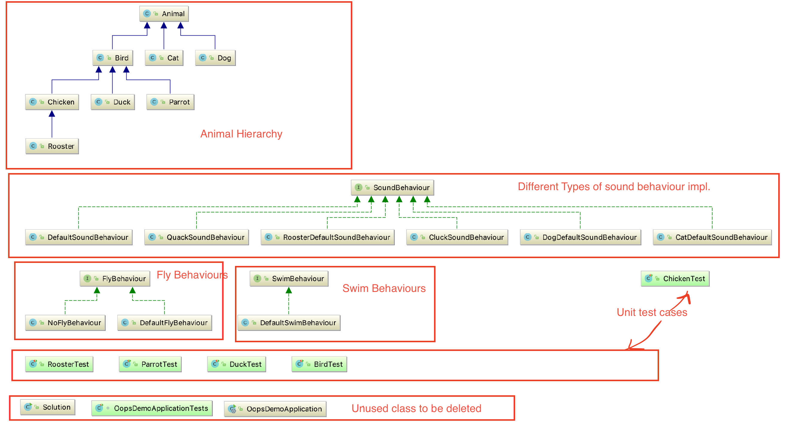

oops-demo
=====================
This is a sample repository to demo oops concepts, specifically modeling objects

### ChangeLog
1. Adding singing behaviour to bird
2. Implemented the chicken and duck, refactored code for maintainability
3. Implemented a rooster
4. Implemented parrot and refactored code for maintainability and future extension
5. Integrated with circle CI

### Class Diagram

